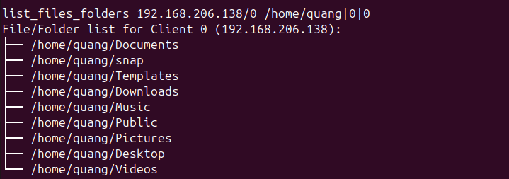
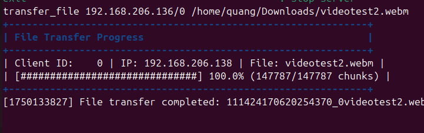
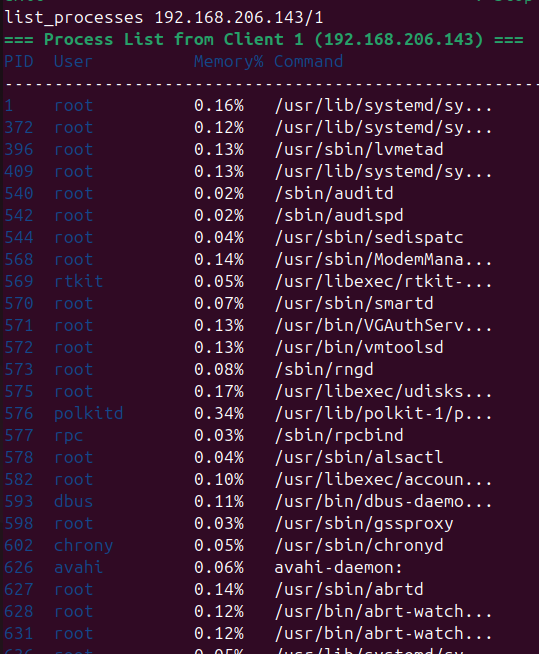
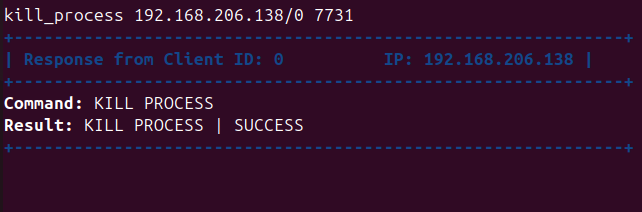
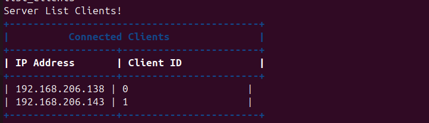

# 🛡️ RAT Project - Remote Access Tool

> 📡 A lightweight, secure, cross-distribution Remote Access Tool with file and process control capabilities.

---

## 📌 Mục tiêu

Xây dựng công cụ **Remote Access Tool (RAT)** gồm hai thành phần **Client** và **Server**, hoạt động trên nhiều máy tính chạy Linux khác nhau, hỗ trợ điều khiển từ xa một cách an toàn và hiệu quả.  

---

## 🚀 Tính năng chính

### 🗂️ 1. Liệt kê file & thư mục từ xa
Server gửi lệnh tới client để truy xuất danh sách file/thư mục tại đường dẫn bất kỳ.

📸 *Minh họa*:


---

### 📄 2. Tải file (hỗ trợ > 1 GB)
Hệ thống chia nhỏ file lớn từ client và ghép lại tại server để tránh giới hạn bộ nhớ.

📸 *Minh họa*:


---

### 🧠 3. Liệt kê các process đang chạy
Hiển thị thông tin tiến trình: PID, tên tiến trình, mức sử dụng CPU và RAM.

📸 *Minh họa*:


---

### 🔪 4. Dừng tiến trình từ xa
Gửi lệnh dừng (kill) tiến trình cụ thể dựa trên PID từ server đến client.

📸 *Minh họa*:


---

### 🖥️ 5. Điều khiển nhiều client đồng thời
Server có thể quản lý và gửi lệnh đến nhiều client đang kết nối cùng lúc.

📸 *Minh họa*:


---

### 📦 6. Đóng gói cài đặt client
Client có thể build & đóng gói dưới dạng:

- CentOS 7:  
  `client/build_centos7/rat-client-1.0.0-1.x86_64.rpm`
- Ubuntu 24.04:  
  `client/build_ubuntu/rat-client_1.0.0_amd64.deb`

---

## 🛠️ Công nghệ sử dụng

- 🔧 **Ngôn ngữ**: C++17  
- 🧠 **Mạng**: Boost.Asio (TCP)  
- 🔐 **Bảo mật**: OpenSSL 3.0 (TLS 1.3)  
- 🧪 **Test**: Catch2  
- 🔨 **Build Tool**: CMake  
- 🐳 **Đóng gói Client**: Dockerfile cho CentOS 7, script cho Ubuntu  

---

## 🧪 An toàn thông tin

✅ Không có các lỗi phổ biến:
- Buffer Overflow
- Integer Overflow
- Format String
- Race Condition
- Type Confusion

✅ Mã hóa toàn bộ giao tiếp bằng TLS  
✅ Kiểm tra đầu vào nghiêm ngặt

---

## 📂 Cấu trúc thư mục

```plaintext
rat_project/
├── client/
│   ├── build/                   # Build mặc định
│   ├── build_centos7/           # Build CentOS (có .rpm)
│   ├── build_ubuntu/            # Build Ubuntu (có .deb)
│   ├── certs/                   # Chứng chỉ TLS
│   ├── include/                 # Header files
│   ├── src/                     # Code nguồn
│   └── CMakeLists.txt
│
├── server/
│   ├── build/
│   ├── certs/
│   ├── include/
│   ├── src/
│   └── CMakeLists.txt
│
├── common/                      # Thư viện chia sẻ giữa server & client
│   ├── build_centos7/
│   ├── build_ubuntu/
│   ├── include/
│   ├── proto/                   # Giao thức truyền tin
│   ├── src/
│   ├── tests/
│   └── CMakeLists.txt
│
├── unit_tests/                 # Test module
│   ├── test_client/
│   ├── test_server/
│   ├── test_common/
│   ├── build/
│   └── CMakeLists.txt
│
├── certs/                      # Chứng chỉ TLS dùng chung
│   ├── ca.crt
│   ├── ca.key
│   ├── server.crt
│   ├── server.key
│   └── dh2048.pem
│
├── docs/
│   └── screenshots/             # Ảnh minh họa
│
├── Dockerfile                  # Docker build client (CentOS 7)
├── reset_and_run_server.sh     # Script khởi chạy lại server
├── reset_and_run_client.sh     # Script khởi chạy lại client
├── generate_tls_cert.sh        # Script tạo chứng chỉ TLS
└── README.md
